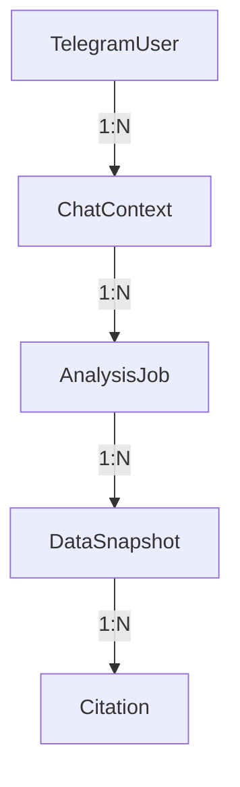

# Task 002: Database Implementation

**Phase**: 1 - Foundation  
**Estimated Hours**: 3  
**Priority**: P1  
**Status**: Not Started

---

## Description

Design and implement the SQLite database schema for the idea-planner-agent MVP. This task creates the data storage foundation for user information, chat context, analysis jobs, and citations.

---

## Acceptance Criteria

- [ ] SQLite database schema designed according to spec requirements (FR-010..FR-013)
- [ ] SQLAlchemy ORM models implemented for all entities (NFR-003)
- [ ] Database migration script created (Engineering Quality VI)
- [ ] All models include proper relationships and constraints
- [ ] Database ready for integration with other components

---

## Subtasks with Hour Estimates

| Subtask | Hours | Description |
|---------|-------|-------------|
| 2.1 Design database schema | 1.0 | Create ER diagram and schema definition |
| 2.2 Implement SQLAlchemy models | 1.5 | Create ORM classes for all entities |
| 2.3 Create migration script | 0.5 | Implement database initialization and migration |

---

## Dependencies

**Depends on**: Task 001 (Project Structure Setup)

**Required for**: Task 005 (ru_search Module), Task 006 (Telegram Bot Logic)

---

## Testing Requirements

- [ ] Verify database schema matches specification requirements
- [ ] Test SQLAlchemy model relationships and constraints
- [ ] Confirm migration script works correctly
- [ ] Validate data integrity and foreign key relationships
- [ ] Test basic CRUD operations for all models

---

## Traceability to Constitution Principles

| Subtask | Constitution Principle | Spec Reference |
|---------|-----------------------|----------------|
| Schema design | Reality-First (III) | FR-010..FR-013 |
| ORM implementation | Engineering Quality (VI) | NFR-003 |
| Migration script | Traceability (II) | Constitution v0.1.1 |
| Data integrity | Citations (IV) | AC-1..AC-4 |

---

## Implementation Notes

### Database Schema Design



### SQLAlchemy Models

```python
# Example: TelegramUser model
from sqlalchemy import Column, Integer, String, DateTime
from sqlalchemy.ext.declarative import declarative_base

Base = declarative_base()

class TelegramUser(Base):
    __tablename__ = 'telegram_users'
    
    id = Column(Integer, primary_key=True)
    user_id = Column(String(50), unique=True, nullable=False)
    language = Column(String(10), default='ru')
    last_interaction = Column(DateTime)
    created_at = Column(DateTime, server_default=func.now())
```

### Entity Definitions

1. **TelegramUser**: User identification and interaction history
   - `user_id`: Unique Telegram user identifier
   - `language`: User language preference (default: 'ru')
   - `last_interaction`: Timestamp of last user interaction

2. **ChatContext**: Current chat state and context
   - `chat_id`: Unique chat identifier
   - `user_id`: Foreign key to TelegramUser
   - `current_mode`: Current analysis mode
   - `last_idea`: Text of last idea analyzed

3. **AnalysisJob**: Asynchronous analysis job tracking
   - `job_id`: Unique job identifier
   - `status`: Job status (queued/running/done/failed)
   - `created_at`: Job creation timestamp
   - `updated_at`: Last update timestamp

4. **DataSnapshot**: Cached data from external sources
   - `snapshot_id`: Unique snapshot identifier
   - `query`: Search query used
   - `source`: Data source (wb/ozon/yandex)
   - `data`: JSON data payload
   - `timestamp`: Data retrieval timestamp
   - `freshness`: Data freshness indicator

5. **Citation**: Citation information for facts
   - `citation_id`: Unique citation identifier
   - `url`: Source URL
   - `timestamp_msk`: Timestamp in Moscow time
   - `note`: Description of what the citation confirms

---

## Database Migration Script

```python
# database/migrate.py
from sqlalchemy import create_engine
from models import Base

def initialize_database(db_path='bot.db'):
    engine = create_engine(f'sqlite:///{db_path}')
    Base.metadata.create_all(engine)
    print(f"Database initialized at {db_path}")

if __name__ == '__main__':
    initialize_database()
```

---

## Success Criteria

- [ ] Database schema matches all specification requirements
- [ ] SQLAlchemy models properly implemented and tested
- [ ] Migration script successfully creates database structure
- [ ] All relationships and constraints working correctly
- [ ] Database ready for integration with ru_search module

---

## Next Tasks

- [ ] Task 003: Configuration System (can be done in parallel)
- [ ] Task 005: ru_search Module (depends on this task)
- [ ] Task 006: Telegram Bot Logic (depends on this task)

---

## References

- **Constitution**: `.specify/constitution.md` v0.1.1
- **Spec**: `.specify/specs/001-core/spec.md` v2.0 (FR-010..FR-013)
- **Plan**: `plan.md` Phase 1.2
- **Architecture**: `architecture-decisions.md` Database section